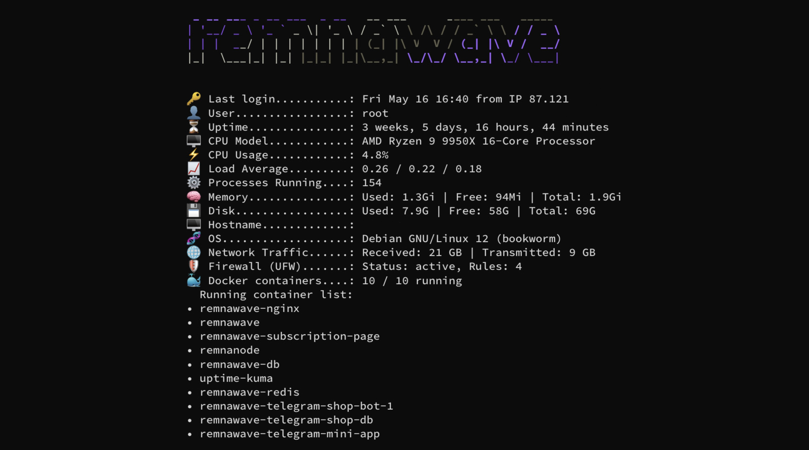

# Remnawave-MOTD (by distillium)



## Installation
1. Run the motd install script: 
```
curl -sSL https://raw.githubusercontent.com/Skrepysh/remnawave-motd/refs/heads/main/install-motd.sh | sudo bash
```
## Commands

- `sudo rw-motd` — manually display the current MOTD.

- `sudo rw-motd-set` — open a menu to enable/disable MOTD info blocks.
